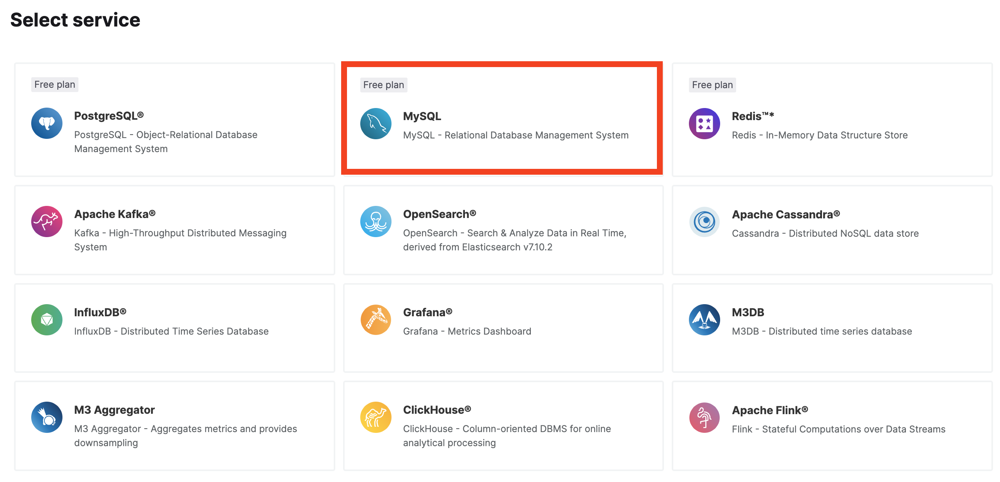
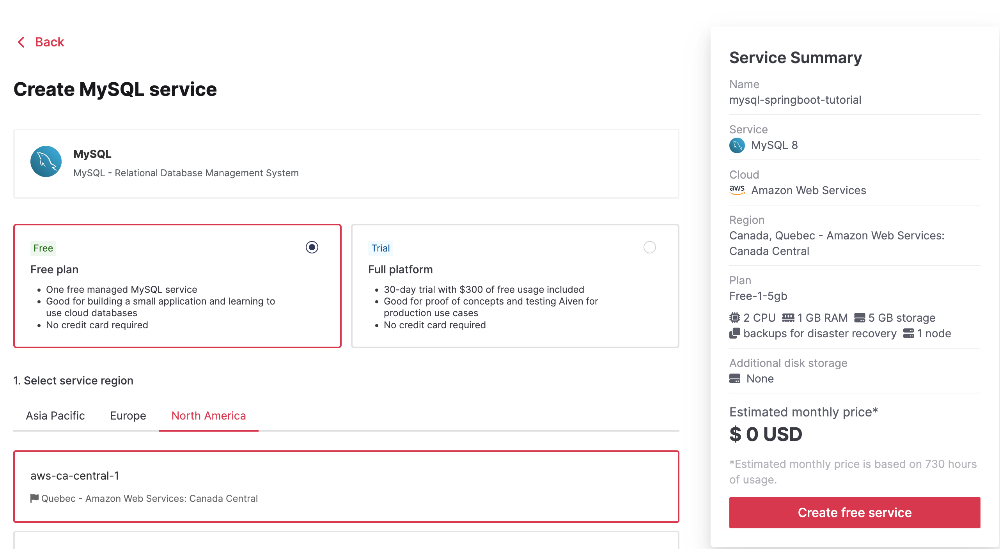
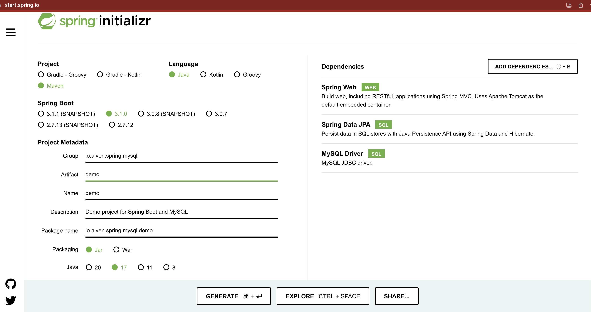
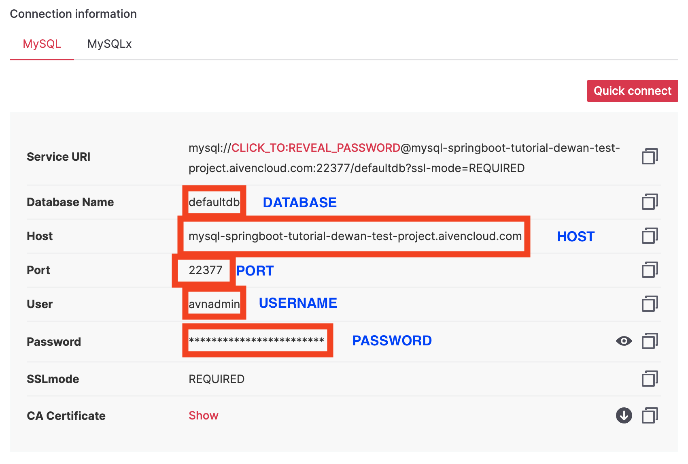

It's your first week as an enterprise Java developer and your project manager asks you to build a demo application for a client project. You're excited to take on the challenge, but you're also a bit nervous - you have never built a web application from scratch before. Sit back and relax as we tackle this challenge as a team.

Just like any other problem, a complex problem can be solved if:

- We understand the requirements clearly
- We break down bigger problem into smaller ones
- We understand the time, performance, and reliability requirements

Once you ask a few questions to your project manager, you realize that the team expects you to build the backend and handle the database part as they have a frontend developer building the UI for the application. Let's choose Java as the language and Spring Boot as the framework. Java's combination of portability, scalability, security, community support, and longevity make it a popular choice for enterprise development. Spring Boot is a popular Java framework that makes it easy to create web applications quickly and efficiently. It provides a wide range of features, including easy configuration, integrated security, and support for multiple data sources, making it a great choice for building modern web applications. 

But you're worried about deploying and managing a relational database in production for your clients. One of your colleague used Aiven before and they suggested a managed MySQL service for this project. Aiven for MySQL will provide automated maintenance, backups, and upgrades, freeing up time and resources for your important project. You also won't have to worry about scalability and high availability and Aiven platform will ensure that the database can handle fluctuations in traffic and data volume without downtime or performance issues.

In this tutorial, we'll work as a team to build a demo backend application with Spring Boot and Aiven for MySQL.

## Prerequisites:

To follow this tutorial, you'll need:

1. A MySQL database: You can use your existing MySQL service. Otherwise, [sign up for an Aiven account](https://console.aiven.io/signup) and [follow the instructions](https://docs.aiven.io/docs/products/mysql/get-started) to create an Aiven for MySQL service on Aiven. (🤫 there's a free tier)

2. Java Development Kit (JDK): You'll need to have the JDK installed on your computer to compile and run the Spring Boot application. You can download the latest version of the JDK from [the Oracle website](https://www.oracle.com/java/technologies/downloads/). At the time of writing this tutorial, there are both Java 17 and Java 20 available for download. You can choose either.

3. IDE: You can use any IDE of your choice to create the Spring Boot project, such as IntelliJ IDEA, Eclipse, Visual Studio Code, or NetBeans.

4. MySQL client: You'll need a MySQL client to connect to your MySQL service and manage your database. You can use any MySQL client of your choice, such as MySQL Workbench, HeidiSQL, or DBeaver. I'm using [mysqlsh](https://dev.mysql.com/doc/mysql-shell/8.0/en/mysqlsh.html) - an advanced command-line client and code editor for MySQL.

## Let's create a MySQL service

If you already have a running MySQL service, feel free to skip this section. In this section, I'll walk you through creating an Aiven for MySQL service. Assuming you've already signed up, navigate to the [Aiven console](https://console.aiven.io/) and click **Create service**.

Select the free plan for Aiven for MySQL (yes, it's forever-free plan!).



Choose the region close to you and give your MySQL service a name. Click **Create service**.



A flashing blue indicator under *Nodes* indicates that your service is being provisioned. A solid green indicates that your MySQL service is running. At this point, go to the service and find connection information from the **Overview** tab.

## Let's create a Spring Boot application

The easiest way to create a Spring Boot application from a template is to use [Spring initializr](https://start.spring.io/). Build the artifact in the following way and click **Generate**. A *demo.zip* will be downloaded which you can extract and open in your favorite IDE.



Use the following as your configuration. If you're using Java 20 instead of Java 17, you might see different options for the Spring Boot version. This tutorial should work either way.

| Project      | Maven                                     |
|--------------|-------------------------------------------|
| Language     | Java                                      |
| Spring Boot  | 3.1.0                                     |
| Group        | io.aiven.spring.mysql                     |
| Artifact     | demo                                      |
| Name         | demo                                      |
| Description  | Demo project for Spring Boot and MySQL    |
| Package name | io.aiven.spring.mysql.demo                |
| Packaging    | Jar                                       |
| Java         | 17                                        |
| Dependency 1 | Spring Web                                |
| Dependency 2 | Spring Data JPA                           |
| Dependency 3 | MySQL Driver                              |

### Add database connection to application.properties

Spring Boot comes with `H2` as the default database. Since you're using a cloud database, you must define the connection attributes in the `application.properties` file. Open the `demo/src/main/resources/application.properties` file and add the following:

```
spring.jpa.hibernate.ddl-auto=update
spring.datasource.url=jdbc:mysql://HOST:PORT/DATABASE
spring.datasource.username=USERNAME
spring.datasource.password=PASSWORD
spring.datasource.driver-class-name=com.mysql.cj.jdbc.Driver
```

You can find the connection information from the **Overview** tab of your Aiven for MySQL service:



> **Note**

> It is a good security practice to set `spring.jpa.hibernate.ddl-auto` to `none` after your database is in a production state. This setting is also the default for MySQL.

### Create the @Entity model

Create the following entity model under `demo/src/main/java/io/aiven/spring/mysql/demo/User.java` which hibernate then translates to a table in your MySQL database:

```
package io.aiven.spring.mysql.demo;

import jakarta.persistence.Entity;
import jakarta.persistence.GeneratedValue;
import jakarta.persistence.GenerationType;
import jakarta.persistence.Id;

// This tells Hibernate to make a table out of this class
@Entity
public class User {
    @Id
    @GeneratedValue(strategy=GenerationType.IDENTITY)
    private Integer id;

    private String name;

    private String email;

    public Integer getId() {
        return id;
    }

    public void setId(Integer id) {
        this.id = id;
    }

    public String getName() {
        return name;
    }

    public void setName(String name) {
        this.name = name;
    }

    public String getEmail() {
        return email;
    }

    public void setEmail(String email) {
        this.email = email;
    }
}

```

> **Note**

>  Aiven for MySQL does not support [creating new tables without primary keys](https://docs.aiven.io/docs/products/mysql/howto/create-tables-without-primary-keys) for security reasons, so the code above uses `GenerationType.IDENTITY`. If you wanted to create a table without primary keys locally or for anothe service, you can use `GenerationType.AUTO`. 

### Create the Repository

Let's create the repository interface to hold user records under `demo/src/main/java/io/aiven/spring/mysql/demo/UserRepository.java`:

```
package io.aiven.spring.mysql.demo;

import org.springframework.data.repository.CrudRepository;

import io.aiven.spring.mysql.demo.User;

// This will be AUTO IMPLEMENTED by Spring into a Bean called userRepository
// CRUD refers Create, Read, Update, Delete

public interface UserRepository extends CrudRepository<User, Integer> {

}
```

### Create the Controller

To handle HTTP requests, let's create the controller class under `demo/src/main/java/io/aiven/spring/mysql/demo/MainController.java`:

```
package io.aiven.spring.mysql.demo;

import org.springframework.beans.factory.annotation.Autowired;
import org.springframework.web.bind.annotation.*;
// This means that this class is a RestController
@RestController
// This means URL's start with /demo (after Application path)
@RequestMapping(path = "/demo")
public class MainController {
    // This means to get the bean called userRepository
    // which is auto-generated by Spring, we will use it to handle the data
    @Autowired
    private UserRepository userRepository;

    // Map ONLY POST Requests
    @PostMapping(path = "/add")
    public @ResponseBody User addNewUser(@RequestParam String name
            , @RequestParam String email) {
        // @ResponseBody means the returned User is the response, not a view name
        // @RequestParam means it is a parameter from the GET or POST request

        User springUser = new User();
        springUser.setName(name);
        springUser.setEmail(email);
        userRepository.save(springUser);
        return springUser;
    }

    @GetMapping(path = "/all")
    public @ResponseBody Iterable<User> getAllUsers() {
        // This returns a JSON or XML with the users
        return userRepository.findAll();
    }

}
```

This controller creates two REST API endpoints - `/all` to list all users and `/add` to add a new user. 

### Create an Application Class

A sample application class is already created by Spring Initializr under `demo/src/main/java/io/aiven/spring/mysql/demo/DemoApplication.java`. You shouldn't need to add anything, but here's the autogenerated code from Initializr:


```
package io.aiven.spring.mysql.demo;

import org.springframework.boot.SpringApplication;
import org.springframework.boot.autoconfigure.SpringBootApplication;

@SpringBootApplication
public class DemoApplication {

	public static void main(String[] args) {
		SpringApplication.run(DemoApplication.class, args);
	}

}
```

`@SpringBootApplication` is an annotation in Spring Boot that configures and launches a Spring Boot application with minimal code. It combines three annotations (`@Configuration`, `@EnableAutoConfiguration`, and `@ComponentScan`) into one, making it easier to bootstrap a Spring Boot application. It enables Spring Boot's auto-configuration mechanism and component scanning, and it also serves as the main entry point of the application.

The `main()` method uses Spring Boot’s `SpringApplication.run()` method to launch an application. This web application is built entirely in Java, and you won't need to worry about configuring any of the underlying infrastructure or plumbing.

## Run and test the application

You can run the application from the command line with Maven (`./mvnw spring-boot:run`) or from the GUI of your code editor. I'm using IntelliJ IDEA and the step to run the application is **Run** --> **Run 'DemoApplication'**. Once you run the application, a Tomcat server will be started on port 8080 of your machine.

Let's test adding a user. From a terminal window, execute:

```shell
curl http://localhost:8080/demo/add -d name="Sponge Bob" -d email=bob@crabby.com
```

Let's test if the user was added. Either navigate to `localhost:8080/demo/all` from a browser or execute the following from a terminal:

```shell
curl http://localhost:8080/demo/all
```

If this is the first time you're running the query, you should see the following output:

```json
[{"id":1,"name":"Sponge Bob","email":"bob@crabby.com"}]
```

## Wrap up

Congratulations! Now you have a proof-of-concept to show your project manager for a demo Spring Boot application with a MySQL backend. You've learned how to set up a new Aiven service, configure your Spring Boot application to connect to it, and perform basic CRUD operations on the database using Spring Data JPA. With this knowledge, you can now confidently develop and deploy more complex applications that leverage the power and convenience of Aiven for MySQL. I'll call that a good start for your important project! 